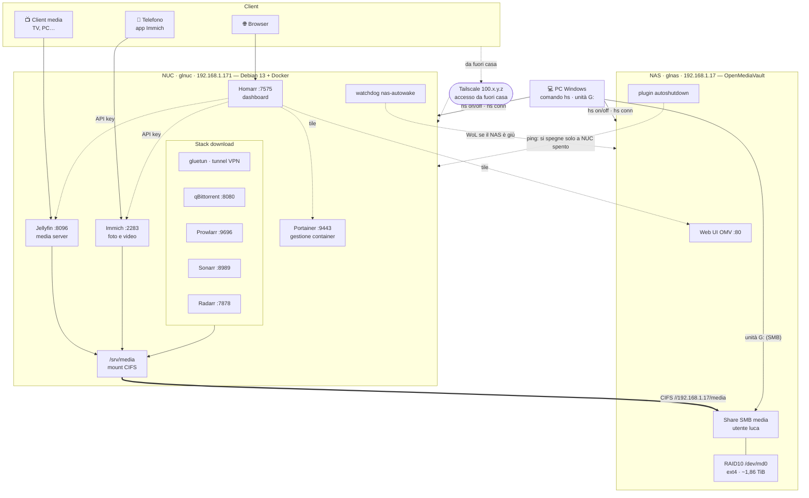
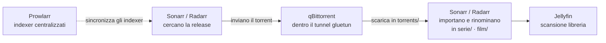

# Architettura — chi fa cosa (NUC, NAS, container e servizi)

*Aggiornato: 4 agosto 2026. Questo documento descrive l'architettura del sistema: cosa fa ogni singolo servizio e come i pezzi comunicano tra loro. Storia e decisioni: [RECAP.md](RECAP.md); gestione energetica: [GESTIONE-ENERGIA.md](GESTIONE-ENERGIA.md).*

## I principi

Due macchine con ruoli netti, che non si sovrappongono mai:

- il **NUC esegue**: tutti i servizi applicativi girano qui, in container Docker, più una manciata di servizi di sistema;
- il **NAS conserva**: nessun applicativo, solo storage esposto via SMB. Se domani il NUC si rompe o va reinstallato, i dati non si toccano.

Attorno a loro:

- il **PC Windows** fa da telecomando (comando `hs`: accende, spegne, apre shell) e monta lo share del NAS come unità `G:`;
- il **telefono** parla con Immich per il backup automatico di foto e video;
- l'accesso **da fuori casa** passa esclusivamente da **Tailscale** (VPN mesh): nessuna porta è mai esposta su internet, il router non ha port forwarding.

Questa separazione ha due conseguenze pratiche che ricorrono in tutto il documento: **tutti i container leggono e scrivono i dati attraverso un unico mount di rete** (`/srv/media`), e l'ordine di accensione/spegnimento delle macchine non è libero (**si accende prima il NAS, si spegne prima il NUC**), perché i servizi senza lo share sotto i piedi non funzionano.

## Vista d'insieme



Legenda: frecce piene = flusso dati/uso quotidiano, tratteggiate = controllo e integrazioni.

## NUC — `glnuc` (192.168.1.171)

Minisforum U500 (i3-5005U, 8 GB RAM, SSD 128 GB), Debian 13 minimale, collegato via ethernet (WiFi spento). È la macchina di calcolo: tutto l'applicativo gira qui in Docker.

L'organizzazione dei container segue una regola semplice: **un compose file per servizio**, in `~/docker/<nome>/docker-compose.yml`. I compose file sono la fonte di verità della configurazione — qualunque cosa si veda in Portainer o altrove, ciò che conta è scritto lì. Fa eccezione lo stack download, che vive in un **compose unico** (`~/docker/arr`) perché i suoi container condividono la rete e devono nascere e morire insieme.

Regola sui media: **direct play sempre**. La iGPU del NUC (Broadwell) sa transcodificare in hardware solo H.264, quindi la strategia è che i client decodifichino da soli i loro formati; la transcodifica è l'eccezione, non la regola.

### Jellyfin — media server (`:8096`)

Il "Netflix di casa": indicizza film, serie e musica presenti su `/srv/media` e li serve in streaming ai client (TV, PC, telefono) tramite web UI e app native.

- **Librerie**: ogni libreria (Film, Serie, Musica) punta a una cartella dello share; Jellyfin fa la scansione, scarica metadati, locandine e sottotitoli.
- **Riproduzione**: di norma il file viaggia com'è (direct play) e il client lo decodifica. Se un client non supporta il formato, Jellyfin può transcodificare al volo: il device `/dev/dri` è passato al container per usare l'accelerazione hardware VAAPI, ma solo verso H.264 — per tutto il resto la transcodifica sarebbe software, lenta su questa CPU. Da qui la regola del direct play.
- **Dati**: legge soltanto dallo share; i propri metadati e la configurazione stanno sul disco locale del NUC.

### Immich — foto e video (`:2283`)

L'alternativa self-hosted a Google Foto. Non è un container singolo ma uno **stack di quattro**, ognuno con un compito preciso:

| Container | Ruolo |
|---|---|
| `immich-server` | l'applicazione vera e propria: API, web UI, gestione upload e album |
| `immich-machine-learning` | i "cervelli": riconoscimento facciale e ricerca semantica (trovare foto scrivendo "tramonto al mare") — gira in locale, nessun dato esce di casa |
| `postgres` | il database: metadati, utenti, album, risultati del machine learning |
| `redis` | coda e cache: coordina i job in background (generazione miniature, analisi ML) |

- **Flusso quotidiano**: l'app sul telefono carica automaticamente foto e video appena scattati; i file finiscono in `/srv/media/immich`, cioè **sul NAS**, dentro il RAID.
- **Il database invece sta sul disco locale del NUC**: Postgres su un mount di rete CIFS è fragile e lento (lock, latenza), quindi i file pesanti vanno sul NAS e il database veloce resta locale.
- **Da fuori casa** funziona la stessa app, puntata all'IP Tailscale del NUC.

### Portainer — gestione container (`:9443`, HTTPS)

Web UI per l'amministrazione di Docker: mostra lo stato di tutti i container e permette di consultare i log, aprire una console dentro un container, riavviarlo o fermarlo — tutto dal browser, senza SSH.

- Parla con Docker attraverso il socket `/var/run/docker.sock` montato nel container.
- Avviato con `--no-setup-token` (setup iniziale senza token temporaneo).
- Serve la pagina in HTTPS con certificato autofirmato: l'avviso del browser è normale.
- È uno strumento di **osservazione e intervento rapido**, non di configurazione: i compose file restano la fonte di verità, le modifiche strutturali si fanno lì.

### Homarr — dashboard (`:7575`)

La pagina di partenza dell'homeserver: un'unica schermata con lo stato di tutti i servizi, da tenere come homepage del browser.

- **Integrazioni via API key** con Jellyfin e Immich: Homarr interroga le loro API e mostra stato e statistiche in tempo reale (cosa è in riproduzione, quante foto caricate…).
- **Tile manuali** per Portainer e per la web UI di OMV: semplici collegamenti, senza integrazione.
- **Widget Docker**: legge `/var/run/docker.sock` montato **in sola lettura** per elencare i container e il loro stato — può guardare, non toccare (a differenza di Portainer).

### Stack download (`~/docker/arr`, compose unico)

Cinque container che insieme formano la catena di automazione dei download: si chiede "voglio questa serie" e il resto avviene da solo. Il compose è unico perché qBittorrent usa la rete di gluetun (`network_mode: service:gluetun`): i due devono vivere e morire insieme.

| Container | Porta | Ruolo |
|---|---|---|
| **gluetun** | — | client VPN in container: crea il tunnel verso il provider VPN e presta la propria rete a qBittorrent. Il traffico torrent esce **solo** dal tunnel; se la VPN cade, qBittorrent resta senza rete e i torrent si fermano — è il **kill switch**, garantito dall'architettura stessa. La porta di qBittorrent è esposta sulla LAN da gluetun |
| **qBittorrent** | `:8080` | il client torrent: riceve i download da Sonarr/Radarr, scarica in `/srv/media/torrents`, notifica il completamento |
| **Prowlarr** | `:9696` | gestione centralizzata degli **indexer** (i siti dove si cercano le release): si configurano una volta qui e Prowlarr li sincronizza automaticamente su Sonarr e Radarr, invece di ripetere la configurazione in ogni app |
| **Sonarr** | `:8989` | automazione per le **serie TV**: si aggiunge una serie, Sonarr cerca gli episodi sugli indexer, sceglie la release migliore secondo i profili di qualità, la manda a qBittorrent, e a download finito **importa** il file in `/srv/media/serie` rinominandolo in modo pulito (`Serie/Stagione 01/Serie - S01E01 - Titolo.mkv`). Continua poi a monitorare le nuove uscite |
| **Radarr** | `:7878` | identico a Sonarr ma per i **film**, con import in `/srv/media/film` |

La catena completa, dall'ordine alla libreria:



### Servizi di sistema (fuori Docker)

| Servizio | A cosa serve |
|---|---|
| **Tailscale** | VPN mesh per l'accesso da fuori casa: il NUC ha un IP `100.x.y.z` raggiungibile dai dispositivi della tailnet ovunque siano; tutti i servizi rispondono su quell'IP con le stesse porte della LAN. Installato sull'host (non in container) così copre tutto il NUC. Niente port forwarding sul router: da internet la casa è invisibile |
| **SSH** (`luca@192.168.1.171`) | manutenzione e spegnimento remoto. La chiave del PC è autorizzata (accesso senza password); il **sudoers è ristretto**: l'utente può eseguire senza password solo `poweroff` e stop/start del timer del watchdog — il minimo per far funzionare `hs off` e mettere in pausa il watchdog, nient'altro |
| **Mount CIFS `/srv/media`** | il ponte dati verso il NAS, definito in fstab: `//192.168.1.17/media` → `/srv/media`. Tutti i container che toccano i media leggono e scrivono qui. È un mount **soft**: se il NAS sparisce, le operazioni falliscono con un errore invece di bloccare i processi per sempre, e al ritorno del NAS lo share si riconnette da solo |
| **Watchdog `nas-autowake`** (systemd timer, ogni 2 min) | il lato NUC della politica energetica "il NAS segue il NUC": se il NAS non risponde, gli manda un pacchetto Wake-on-LAN; se lo share risulta smontato, lo rimonta e riavvia i container che lo usano (che nel frattempo potrebbero aver visto una cartella vuota) |
| **Drop-in `docker.service.d/after-media.conf`** | ordina l'avvio al boot: Docker parte **dopo** `srv-media.mount`, così i container non nascono mai con lo share mancante sotto i piedi |

## NAS — `glnas` (192.168.1.17)

HP MicroServer N40L (Turion II Neo, 6 GB RAM), con **OpenMediaVault** installato su chiavetta USB — i quattro alloggiamenti disco restano tutti per i dati. Nessun container, nessun applicativo: solo storage e i servizi che OMV si porta dietro.

| Elemento | A cosa serve | Note |
|---|---|---|
| **Web UI OMV** (`http://192.168.1.17`) | amministrazione completa del NAS dal browser (utente `admin`): dischi, RAID, share, utenti, plugin | OMV scrive le modifiche in un database interno e le applica solo alla conferma: ogni modifica va confermata dalla barra gialla "Pending changes" |
| **RAID10 `/dev/md0`** (4× HDD 1 TB, ext4, ~1,86 TiB utili) | lo spazio dati vero e proprio. RAID10 = due coppie in mirror, unite in striping: metà dello spazio grezzo, ma tolleranza al guasto di un disco per coppia e buone prestazioni in lettura | dischi datati (~15 anni): SMART monitorato da OMV, 0 settori riallocati al setup |
| **Share SMB `media`** (utente `luca`) | l'**unica** cartella condivisa del NAS, esposta via SMB/CIFS. La montano il NUC (`/srv/media`, per i container) e il PC (unità `G:`, per l'accesso diretto ai file) | autenticazione con l'utente `luca` |
| **SSH** (`root@192.168.1.17`) | manutenzione e spegnimento remoto (`hs off nas` esegue `poweroff` via SSH); chiave del PC autorizzata | |
| **Plugin flashmemory** | sposta in RAM le scritture frequenti del sistema (log, file temporanei) e le riversa sulla chiavetta USB solo periodicamente: le chiavette hanno cicli di scrittura limitati, così l'OS non la consuma | |
| **Plugin autoshutdown** | il lato NAS della politica energetica: fa ping **solo** all'IP del NUC (`192.168.1.171`) e, quando il NUC non risponde più da ~18 minuti, spegne il NAS da solo. Puntare solo il NUC evita che il PC o il telefono accesi tengano su il NAS inutilmente | dettagli e scenari: [GESTIONE-ENERGIA.md](GESTIONE-ENERGIA.md) |
| **Wake-on-LAN** | accensione remota: la scheda di rete resta in ascolto anche a NAS spento e si sveglia al "magic packet" (inviato da `hs on nas` dal PC o dal watchdog del NUC) | MAC `3C:D9:2B:0C:F3:87`; piano B se il WoL non arriva: BIOS "Restore on AC Power Loss = Power On", il NAS riparte togliendo e ridando corrente |

### Layout dello share `media`

Un'unica gerarchia, vista identica da tutti (`/srv/media` sul NUC, `\\192.168.1.17\media` = `G:` sul PC):

```
/srv/media
├── file/        archivio di file generici, usato direttamente dal PC via G:
│                (nessun servizio ci legge o scrive)
├── immich/      foto e video caricati da Immich (originali, dentro il RAID)
├── musica/      libreria musicale, letta da Jellyfin
├── film/        libreria film: Radarr importa qui, Jellyfin legge
├── serie/       libreria serie TV: Sonarr importa qui, Jellyfin legge
└── torrents/    area di lavoro di qBittorrent: i download attivi e completati,
                 prima che Sonarr/Radarr li importino nelle librerie
```

## Come si interfacciano i pezzi

### Il flusso dati: tutto passa da `/srv/media`

Il mount CIFS è **l'unico canale dati** tra NUC e NAS. Jellyfin ci legge le librerie, Immich ci scrive foto e video, qBittorrent ci scarica, Sonarr e Radarr ci spostano e rinominano i file. Nessun container ha dischi dati propri sul NUC (solo config e database, che stanno sull'SSD locale). Questa dipendenza è il motivo dell'ordine obbligato: **accensione NAS→NUC, spegnimento NUC→NAS** — un NUC acceso senza NAS ha i servizi in piedi ma senza dati.

### La catena download: da "voglio questo film" alla libreria

Prowlarr tiene la lista degli indexer e la sincronizza su Sonarr e Radarr → Sonarr/Radarr cercano la release e la mandano a qBittorrent → qBittorrent scarica in `torrents/` passando esclusivamente dal tunnel di gluetun (VPN giù = download fermi, mai traffico in chiaro) → a download completato Sonarr/Radarr importano il file in `serie/` o `film/` con nome pulito → Jellyfin lo trova alla scansione della libreria. L'utente vede solo il primo passo (la richiesta) e l'ultimo (il contenuto pronto).

### La dashboard: Homarr come punto d'osservazione

Homarr interroga Jellyfin e Immich con le rispettive **API key** e mostra stato e attività; per Portainer e OMV offre semplici tile di collegamento; con il widget Docker legge il socket (in sola lettura) e mostra la salute di tutti i container. Portainer, con lo stesso socket ma in lettura/scrittura, è invece lo strumento d'intervento: log, console, restart.

### Il controllo dal PC: il comando `hs`

Il PC Windows orchestra le accensioni e gli spegnimenti: `hs on nas/nuc` manda il Wake-on-LAN, `hs off nuc/nas` esegue `poweroff` via SSH (con chiavi autorizzate e, sul NUC, sudoers ristretto), `hs conn nas/nuc` apre una shell, `hs` da solo mostra lo stato di entrambe le macchine. In più il PC monta lo share come unità `G:` per lavorare sui file direttamente da Esplora risorse.

### L'accesso da fuori: Tailscale

Da fuori casa cambia solo l'indirizzo: al posto di `192.168.1.171` si usa l'IP Tailscale `100.x.y.z` del NUC, con le stesse porte (l'app Immich sul telefono, ad esempio, punta a quell'IP). Tailscale crea un tunnel cifrato diretto tra i dispositivi della tailnet: niente port forwarding, niente servizi esposti su internet, niente da ricordarsi di chiudere.

### L'energia: "il NAS segue il NUC"

La politica è applicata dai due lati in modo indipendente, così nessuna delle due macchine deve fidarsi dell'altra:

- **lato NUC (svegliare)**: il watchdog `nas-autowake` controlla ogni 2 minuti; NAS spento → WoL; share smontato → rimonta e riavvia i container coinvolti;
- **lato NAS (spegnersi)**: il plugin autoshutdown fa ping al solo NUC; ~18 minuti senza risposta → spegnimento automatico.

Risultato: si accende e si spegne solo il NUC (o si lascia fare a `hs`), e il NAS si adegua da solo nei minuti successivi. Scenari completi e tempi in [GESTIONE-ENERGIA.md](GESTIONE-ENERGIA.md).

## Mappa indirizzi e porte

| Cosa | Indirizzo |
|---|---|
| Jellyfin | http://192.168.1.171:8096 |
| Immich | http://192.168.1.171:2283 |
| Portainer | https://192.168.1.171:9443 (avviso certificato: normale) |
| Homarr | http://192.168.1.171:7575 |
| qBittorrent | http://192.168.1.171:8080 |
| Sonarr | http://192.168.1.171:8989 |
| Radarr | http://192.168.1.171:7878 |
| Prowlarr | http://192.168.1.171:9696 |
| Web UI OMV | http://192.168.1.17 |
| SSH NUC | `luca@192.168.1.171` — scorciatoia: `hs conn nuc` |
| SSH NAS | `root@192.168.1.17` — scorciatoia: `hs conn nas` |
| Share SMB | `\\192.168.1.17\media` (mappato come `G:` sul PC) |
| Da fuori casa | stessi servizi, stesse porte, sull'IP Tailscale `100.x.y.z` del NUC |

> ⚠️ Gli IP sono assegnati via DHCP **senza lease statico** (scelta rimandata per trasloco/cambio router in arrivo). Se cambiano, la checklist completa dei posti da aggiornare è in [GESTIONE-ENERGIA.md](GESTIONE-ENERGIA.md) § "Trasloco / cambio router".
